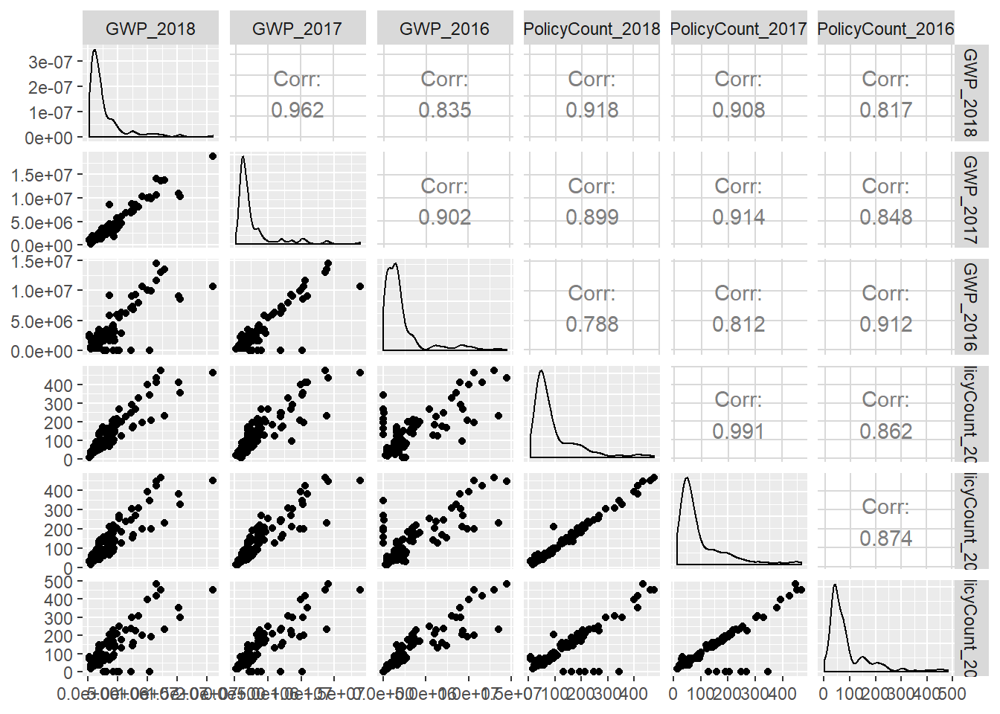
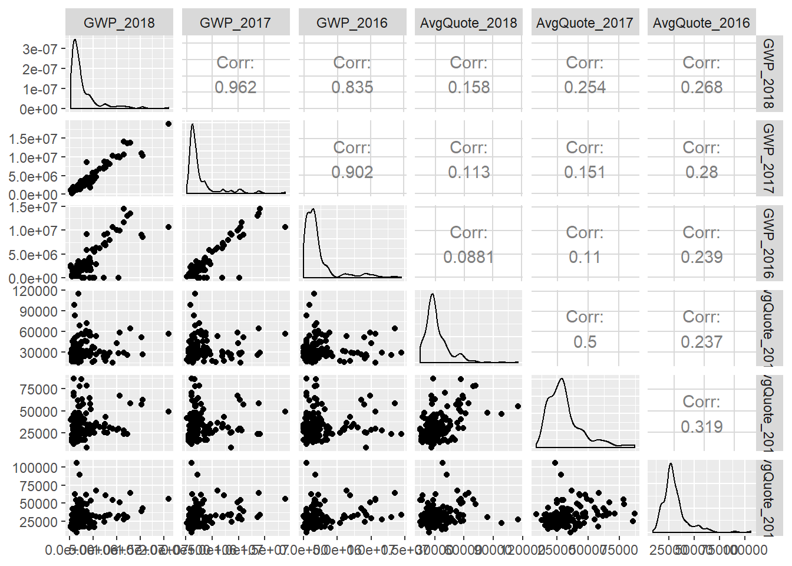

## <b><span style="font-family: Book Antiqua; font-size: 0.8em;">Exploratory Data Analysis</b>

<span style="font-family: Times New Roman; font-size: 1em;">We can generate additional metrics to measure broker performance: "Hit Ratio", "Quote Ratio" & "Success Ratio"
Let's create a second data frame called “myBDFclean”. In this data frame variables pertaining to the years 2013 and 2014 need to be excluded. 
Furthermore, this data frame can be used to generate additional features/ calculations to measure broker performance using the function “mutate”. 
The new calculated fields include supplementary operational metrics such as, <br>
<br><span style="font-family: Times New Roman; font-size: 1em;"><b>“Quote Ratio” for year x</b>: Quote count for the year x/ Submissions for the year x, 
<br><b>“Hit Ratio” for year x</b>: Policy count for the year x/ Quote count for the year x
<br><b>“Success Ratio” for years x....n</b>: sum(Policy count for year x...n)/ sum(Submissions for year x...n)

<span style="font-family: Times New Roman; font-size: 1em;">With respect to the broker segmentation task, we need to create a subset named; “myalchemySubset” from the data frame “myBDFClean”. This subset includes three years’ worth of data required for the clustering. 
The variables chosen for part 1 of the project were, quote counts: 'QuoteCount' from 2016 to 2018, policy counts: 'PolicyCount' from 2016 to 2018, gross written premiums: GWP from 2016 to 2018 as well as the newly generated measure; success ratio (from 2016 to 2018).


``` r
# To remove unnecessary columns before clustering creating new DF only for clustering
myBDFclean <- myBDF %>%
  mutate(quote_ratio2016 = QuoteCount_2016/ Submissions_2016,
         quote_ratio2017 = QuoteCount_2017/ Submissions_2017,
         quote_ratio2018 = QuoteCount_2018/ Submissions_2018,
         hit_ratio16 = PolicyCount_2016/ QuoteCount_2016,
         hit_ratio17 = PolicyCount_2017/ QuoteCount_2017,
         hit_ratio18 = PolicyCount_2018/ QuoteCount_2018,
         success_ratio16_18 = PolicyCount_2016+ PolicyCount_2017 + PolicyCount_2018/
           Submissions_2016 + Submissions_2017 + Submissions_2018)  %>%
  select(-Submissions_2014, -QuoteCount_2013, -QuoteCount_2014, -AvgQuote_2013, -AvgQuote_2014)

# Calculating NAs = 0
sum(is.na(myBDFclean)) 
```

    ## [1] 0

## <b><span style="font-family: Book Antiqua; font-size: 0.75em;">Correlation Graphs</b>

<span style="font-family: Times New Roman; font-size: 1em;">To get a deeper insight into the data we can generate a series correlation graphs using the 'ggcorr' function of the 'Ggally' library
``` r
# Plotting correlation plots with GWP (2016 to 2018) against all other variables
ggcorr(myBDFclean)
```

<!-- -->

``` r
ggpairs(myBDFclean, columns = c("GWP_2018", "GWP_2017", "GWP_2016","hit_ratio18", "hit_ratio17", "hit_ratio16" ))
```

<!-- -->

``` r
ggpairs(myBDFclean, columns = c("GWP_2018", "GWP_2017", "GWP_2016", "quote_ratio2018", "quote_ratio2017", "quote_ratio2016"))
```

<!-- -->

``` r
ggpairs(myBDFclean, columns = c("GWP_2018", "GWP_2017", "GWP_2016", "PolicyCount_2018", "PolicyCount_2017", "PolicyCount_2016"))
```

<!-- -->

``` r
ggpairs(myBDFclean, columns = c("GWP_2018", "GWP_2017", "GWP_2016", "success_ratio16_18"))
```

<!-- -->

``` r
ggpairs(myBDFclean, columns = c("GWP_2018", "GWP_2017", "GWP_2016", "QuoteCount_2018", "QuoteCount_2017", "QuoteCount_2016"))
```

<!-- -->

``` r
ggpairs(myBDFclean, columns = c("GWP_2018", "GWP_2017", "GWP_2016", "Submissions_2018", "Submissions_2017", "Submissions_2016"))
```

<!-- -->

``` r
ggpairs(myBDFclean, columns = c("GWP_2018", "GWP_2017", "GWP_2016", "AvgQuote_2018", "AvgQuote_2017", "AvgQuote_2016"))
```

<!-- -->

``` r
ggpairs(myBDFclean, columns = c("GWP_2018", "GWP_2017", "GWP_2016", "AvgTIV_2018", "AvgTIV_2017", "AvgTIV_2016"))
```

<!-- -->


## <b><span style="font-family: Book Antiqua; font-size: 0.75em;">Summary Statistics</b>

``` r
# Based on correlation graphs creating a subset of all important variables for clustering

myalchemySubset <- (myBDFclean [, c("QuoteCount_2016", "QuoteCount_2017", "QuoteCount_2018", 
                                    "PolicyCount_2016", "PolicyCount_2017", "PolicyCount_2018",
                                    "GWP_2016", "GWP_2017", "GWP_2018", "success_ratio16_18")])

summary(myalchemySubset)
```

    ##  QuoteCount_2016  QuoteCount_2017  QuoteCount_2018  PolicyCount_2016
    ##  Min.   :   1.0   Min.   :   1.0   Min.   :   1.0   Min.   :  1.00  
    ##  1st Qu.:  60.0   1st Qu.:  52.0   1st Qu.:  77.0   1st Qu.: 37.00  
    ##  Median : 123.0   Median : 108.5   Median : 137.5   Median : 60.50  
    ##  Mean   : 240.4   Mean   : 222.4   Mean   : 259.7   Mean   : 90.42  
    ##  3rd Qu.: 221.5   3rd Qu.: 254.5   3rd Qu.: 252.5   3rd Qu.: 94.75  
    ##  Max.   :2789.0   Max.   :2063.0   Max.   :4216.0   Max.   :482.00  
    ##  PolicyCount_2017 PolicyCount_2018    GWP_2016           GWP_2017       
    ##  Min.   : 15.0    Min.   :  6.00   Min.   :    4553   Min.   :  267093  
    ##  1st Qu.: 43.0    1st Qu.: 41.00   1st Qu.:  473456   1st Qu.: 1155401  
    ##  Median : 62.0    Median : 62.00   Median : 1476275   Median : 1698394  
    ##  Mean   : 99.2    Mean   : 98.59   Mean   : 2275913   Mean   : 2715892  
    ##  3rd Qu.:125.8    3rd Qu.:122.75   3rd Qu.: 2247211   3rd Qu.: 2700402  
    ##  Max.   :466.0    Max.   :475.00   Max.   :14503932   Max.   :18815197  
    ##     GWP_2018        success_ratio16_18
    ##  Min.   :  230565   Min.   :  98.33   
    ##  1st Qu.:  861229   1st Qu.: 334.37   
    ##  Median : 1692199   Median : 528.36   
    ##  Mean   : 2747650   Mean   : 836.94   
    ##  3rd Qu.: 3140648   3rd Qu.:1042.60   
    ##  Max.   :21032163   Max.   :4932.15